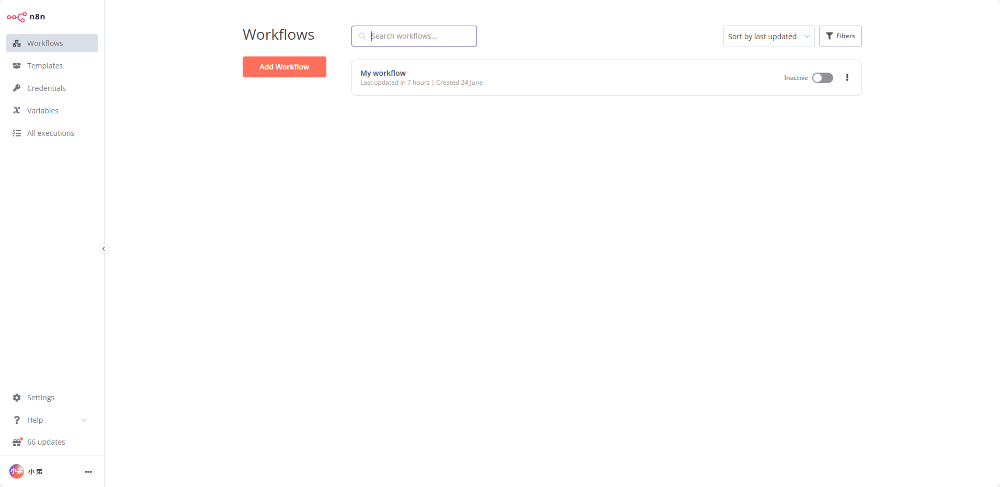
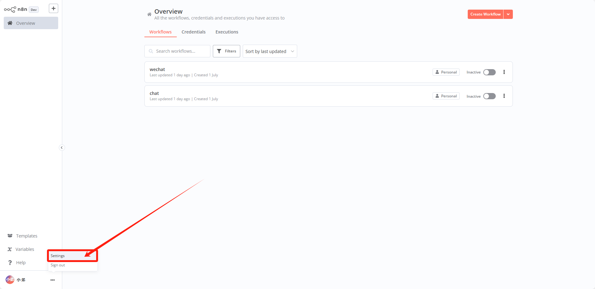
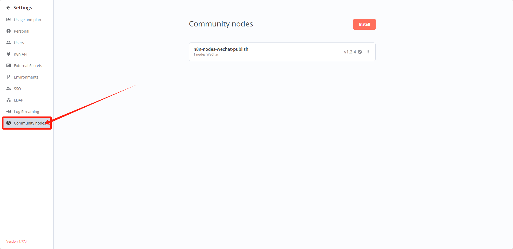
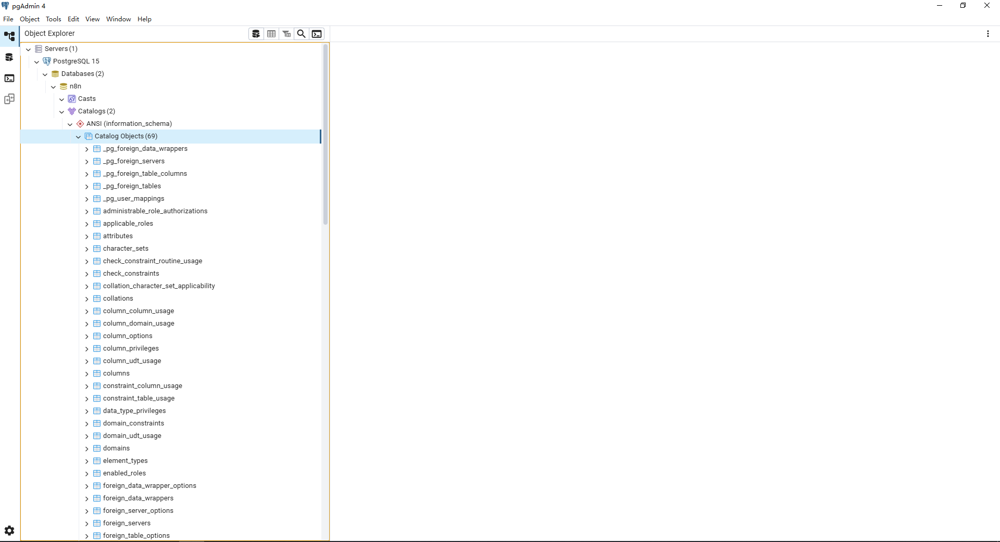

<!--
 * @Descripttion:
 * @version: 1.0.0
 * @Author: htang
 * @Date: 2025-06-24 16:18:30
 * @LastEditors: htang
 * @LastEditTime: 2025-07-03 09:02:50
-->
# n8n

[](https://github.com/opendidi/pano/blob/main/LICENSE)
[]()

- 本地运行

- 下载依赖 需要node版本 v20.18.1

```ssh
> pnpm install
```


- 启动项目,需要(n8n-nodes-wechat-offiaccount项目打包完成后运行)

```ssh
> pnpm start
```

- 浏览器打开

```ssh
> http://localhost:5678
```

- 项目启动后的界面
#### 

- 按照插件
#### 
#### 

- 创建一个n8n数据库图片如下，数据表运行n8n会自动创建：
#### 